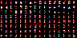

# Bitmap Pixel Font Visualizer

**Load a pixel font sheet easily and start typing text with it.**

Download the executable: [Pixel Font Vizualizer.zip](https://github.com/akirbaes/Pixel-Font/releases)

/fonts contains the character sheets in .png and the data to display it in .json

## What's needed:

- the font's image with all characters spaced out evenly.

>**tekitou_gold**.png  

- a .txt of the same name with all the characters in the font image in the right place.

>**tekitou_gold**.txt  
~~~~
ABCDEFGHİJ
KLMNOPQRST
UVWXYZ
,.!?()'
´`^¨I
~~~~

Drag the .png on font_to_data.py which then generates a .json with the sheet infos (positions, sizes of each character)

>**badlydrawn**.json  
Contains positions of each character on the image, background color, max width, max height

font_visualizer.py in the root will scan for .png in the /fonts folder and load them. You can then use them to show text!

The text is customizable and there are many options to change. Options are saved per-font!

## Secrets: 

- put "mono" in the file name before sending it to font_to_data.py to force the font to work as a  monospace font. The width would use the widest available character.

- the font character size is aligned horizontally based on the leftmost and rightmost pixel for each character. If you want some control over the alignment, put "aligned" in the file name to align based on the pixel accross all characters that is the most on the left.

----

# Notable fonts

The main purpose of the application was to visualise some special pixel fonts, including colored bitmap fonts.

## **MicroRed** (also µRed)

MicroRed is a 2x4 ascii colored font and probably close to the most compact font possible outside of a 3x3.

### Variations: 

|  ||
|:-----------------------------------------------------------------|:---------------------------|
|  | **µRed_Mono** has a fixed size of 2x4. |
|    | **µRed_wide** has a fixed height of 4, but a variable width to allow for characters like W, M, N, H to be more readable. |
| | **µRed_wide_tall** doesn't have a fixed height. Characters like "g", "p", "q" and "," hang one pixel lower for aestetic purposes. |
| | **µCursive** is a cursive-style variation that is somehow very readable. |

The font set uses RGB subpixels to represent letters, so it needs colors to work. The rightmost pixels is always at most red, so two letters can be adjacent without a pixel of separation and still be reasonably readable, since there are still two empty subpixels between the letters. **This makes the mono version as compact as a 1 pixel wide font in practice!**

The name "µRed" (Micro Red) is based on the small size (smaller than regular pixel fonts), and the red appearance. The color red appears often  because of how a lot of letter shapes cover just the leftmost subpixel. The font works on a black background. While the negative (cyan on white background) is possible I find it harder to read. You can see here what you could see if you could separate the subpixels:

One last property is that zooming in the font digitally will render it unreadable (due to the subpixels being turned into whole pixels) especially if the characters are close together. Interesting for hiding messages "in plain sight" or messing with people. Real-life magnifying glass can be considered as an alternative for zooming! Otherwise, you will have to lean closer to your screen which can cause eyes strain. 

### Example:

|  | `I am the most hideous creature in the realm. ☺♫`   `A more abject appearance you will not find. ☻♪`   `I have fallen countless times, and yet I am here. ▼↓`   `Is it not proof that I possess the stone of life? ♥☼`|
|:------|:----------|

If you simply zoom into it, the subpixels will smudge and become unreadable:

If you could zoom into it while maintaining the subpixels structure, this is how it would look:

I'm not the first (nor the last) to play with the idea. [Examples: Militext](https://news.ycombinator.com/item?id=18702900), [TinyFont](https://mrl.nyu.edu/~perlin/homepage2006/tinyfont/), etc. I originally created the ascii 2x4 mono red font around 2016 (based on the file's date on my old computer). I was planning to debut it in a game, then time passed... The font is still being tweaked and extended over time with more characters and better readability in mind. The cursive version is a recent addition. 

## **My handwriting**

> 

This font is based on my handwriting. It was scanned and cut up in pieces. 

>

The software can mash together accents automatically if you provide the top part and the bottom part. For the accents on the i, you must explicitly provide an image for a dotless ı if you want it to work.
