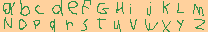
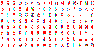
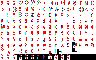
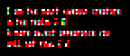
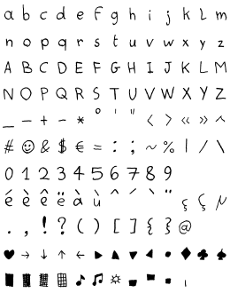

# Bitmap Pixel Font Visualizer

**Load a pixel font sheet easily and start typing text with it.**

/fonts contains the character sheets in .png and the data to display it in .json

## What's needed:

- the font's image with all characters spaced out evently.

>**badlydrawn**.png  

- a .txt of the same name with all the characters in the font image (including empty spaces).

>**badlydrawn**.txt  
~~~~
ABCDEFGHIJKLM  
NOPQRSTUVWXYZ  
~~~~

Drag the .png on font_to_data.py which then generates a .json with the sheet infos (positions, sizes of each character)

>**badlydrawn**.json  
Contains positions of each character on the image, background color, max width, max height

font_visualizer.py in the root will scan for .png in the /fonts folder and load them. You can then use them to show text!

The text is customizable and there are many options to change. Options are saved per-font!

## Secrets: 

- put "mono" in the file name before sending it to font_to_data.py to force the font to work as a  monospace font. The width would use the widest available character.

- the font character size is aligned horizontally based on the leftmost and rightmost pixel for each character. If you want some control over the alignment, put "aligned" in the file name to align based on the pixel accross all characters that is the most on the left.

----

# Notable fonts

The main purpose of the application was to visualise some special pixel fonts, including colored bitmap fonts.

## **MicroRed** (also µRed)

MicroRed is a 2x4 ascii colored font and probably close to the most compact font possible outside of a 3x3.

Variations: **µRed_Mono** has a fixed size of 2x4. **µRed_wide** has a fixed height of 4, but a variable width to allow for characters like W, M, N, H to be more readable. **µRed_wide_tall** doesn't have a fixed size but allows for more characters and readability.

>  

The font set uses RGB subpixels to represent letters, so it needs colors to work. The rightmost pixels is always at most red, so two letters can be adjacent without a pixel of separation and still be reasonably readable, since there are still two empty subpixels between the letters. **This makes the mono version as compact as a 1 pixel wide font in practice!**

The name "µRed" "MicroRed" is based on the small size (maybe the smallest "readable" font ever?), and the red appearance. The color red appears often  because of how a lot of letter shapes cover just the leftmost subpixel. The font works on a black background. While the negative (cyan on white background) is possible I find it harder to read. You can see here what you could see if you could separate the subpixels:

>

One last property is that zooming in the font digitally will render it unreadable (due to the subpixels being turned into whole pixels) especially if the characters are close together. Interesting for hiding messages "in plain sight" or messing with people. Real-life magnifying glass can be considered as an alternative for zooming! Otherwise, you will have to lean closer to your screen which can cause eyes strain. Example:

 

If you could zoom into it and have it work, this is how it would look:

I originally created the µRed (originally MiniRed) around 2016. It's still being tweaked and extended over time. Send me a hello if you use it or if you have a similar idea! (@akirabaes on Twitter)

## **My handwriting**

> 

This font is based on my handwriting. It was scanned and cut up in pieces. 

>

The software can mash together accents automatically if you provide the top part and the bottom part (including a dotless ı).
