# Bitmap Pixel Font Visualizer

### Load a pixel font sheet easily and start typing text with it!

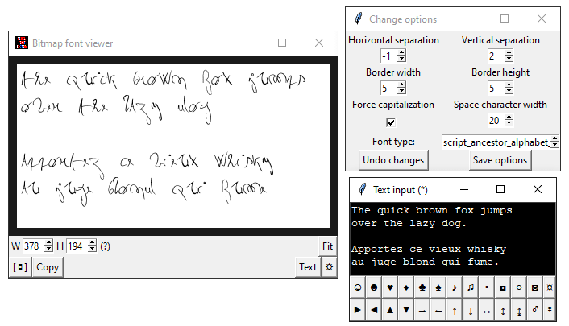

## Download standalone executable: [\[↓\]Pixel Font Vizualizer.zip](https://github.com/akirbaes/Pixel-Font/releases)

Otherwise:

> PIL: `pip install pillow`
>
> pyscreenshot: `pip install pyscreenshot`
>
> win32clipboard (optional): `pip install pywin32`
>
> `python font_visualizer.pyw`

Then just add your fonts to the /fonts folder to use them in the program!

## Features

* Easily visualize and tweak your pixel-font text

* Take pictures, copy to clipboard, or use the generated JSON to load it elsewhere

* Generate missing accents

* Letter spacing/automatic kerning options (offsets generated as separate JSON)

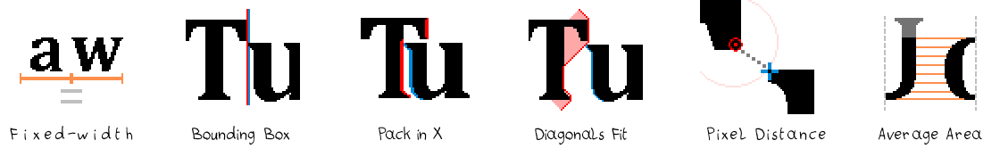

## What's needed:

- the font's image (preferably transparent PNG) with all characters spaced out evenly.

>**tekitou_gold**.png 
> 
>

- a .txt of the same name with all the characters in the font image in the right place.

>**tekitou_gold**.txt  
>~~~~
>ABCDEFGHİJ
>KLMNOPQRST
>UVWXYZ
>,.!?()'
>´`^¨I
>~~~~

### And that's all!

font_visualizer.py in the root will scan for .png in the /fonts folder and load them. You can now use them to show text!

>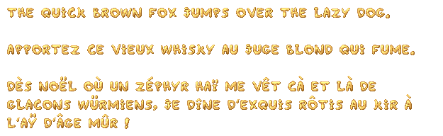

The text is customizable and there are many options to change. Options are saved per-font!

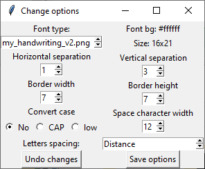

## Accents

If you provide acute, grave, circumflex, diacritic, tilde accent characters, they can be used to generate accented vowels without your explicit input. However, you have to provide the image of a dotless i (ı) if you want accented i to work correctly.

|Handwriting_accents.txt | Handwriting_accents.png |
|:--------------------------------------------------------|:---------------------------|
 | 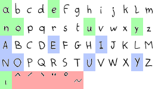 |  `abcdefghijklm`    `nopqrstuvwxyz`    `ABCDEFGHIJKLM`    `NOPQRSTUVWXYZ`    ``ı^´`¨°~``    |

Result:

>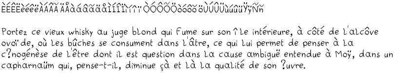

If you are unhappy with the result, you can still provide the accented characters yourself.

## Generated files:

* YourFont.ini will contain basic font options (horizontal and vertical separations, size of space character, case changes, used spacing/kerning arlgorithm).

* YourFont.json will contain the position of every letter in YourFont.png in the form of 'A' : [x, y, width, height] where 'A' is a string of length 1, plus some other data (background color, max width and height).

*  YourFont.Kern\* will contain the offset for each kerning pair it detected in the form of "AZ" : offset where "AZ3 is a string of length 2. To add to the horizontal separation found in YourFont.ini and the width of the character found in YourFont.json.

## Other secrets: 

- Fixed Width mode uses the widest available character at hsep=0. 

- Hsep is not added to space size.

- The font character size is aligned horizontally based on the leftmost and rightmost pixel for each character. If you want some control over the alignment, put "aligned" in the file name to align based on the pixel accross all characters that is the most on the left.

- The .json file of your font's name is automatically generated the first time you use it. It contains all the positions of your characters (x,y,w,h), and the background color. You can edit it if you still feel that the automatic cropping failed. 

- Same for the kerning values, but they are only re-generated if you click "Save Options".

----

# Notable fonts

The main purpose of the application was to visualise custom-made pixel fonts. Here are some of my creations:

## **My handwriting**

> 

This font is based on my handwriting. It was scanned and cut up in pieces. 

## **Dancing font**

>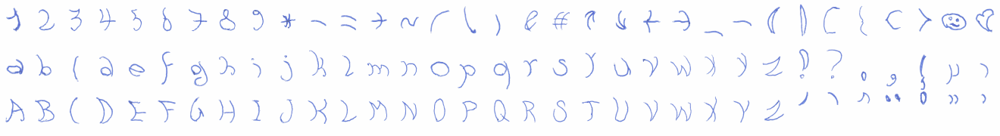

Three separate handwritten fonts scanned and aligned to make an animation. My program doesn't actually take in account animation, so they are effectively three fonts with shared proportions.

## **Future Cipher**

>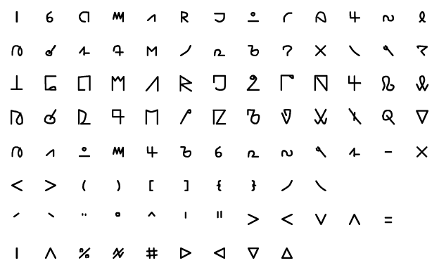 

A basic replacement cipher based on deformations of latin script.

## **Subpixel fonts**

|Font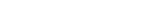 Sampletext | Preview photo |Description|
|:---------|--|:-------|
|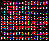 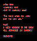|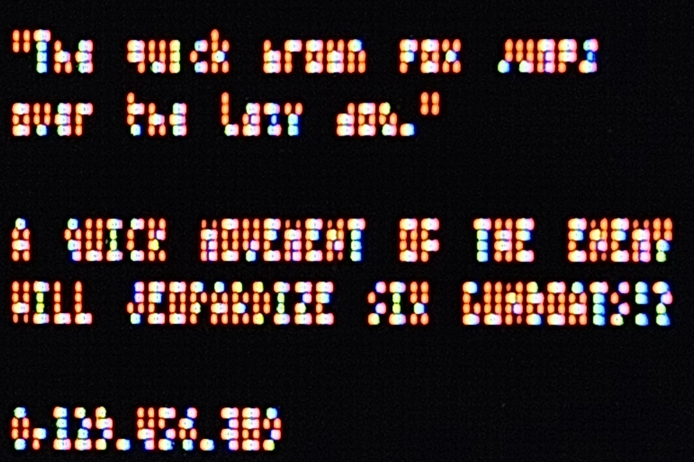 | **µRed_Mono** (pronounced Micro-Red) has a fixed size of 2x4. Probably close to the most compact font possible outside of a 3x3.|
|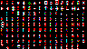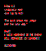|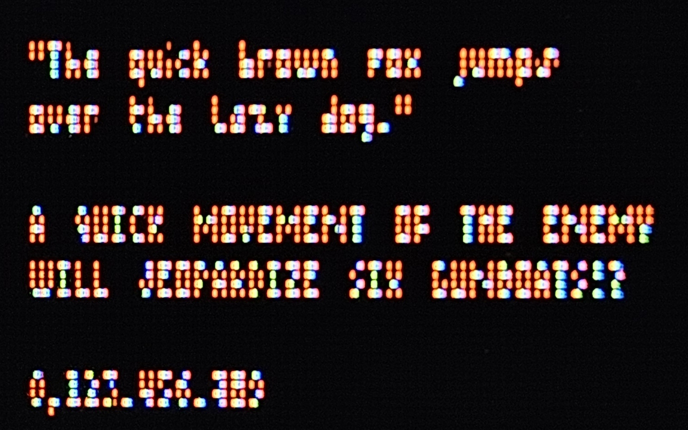|**µRed_v2** has variable width to allow for characters like W, M, N, H to be more readable. Characters like "g", "p", "q" and "," also hang one pixel lower for aesthetic purposes. |
|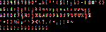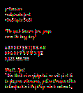 |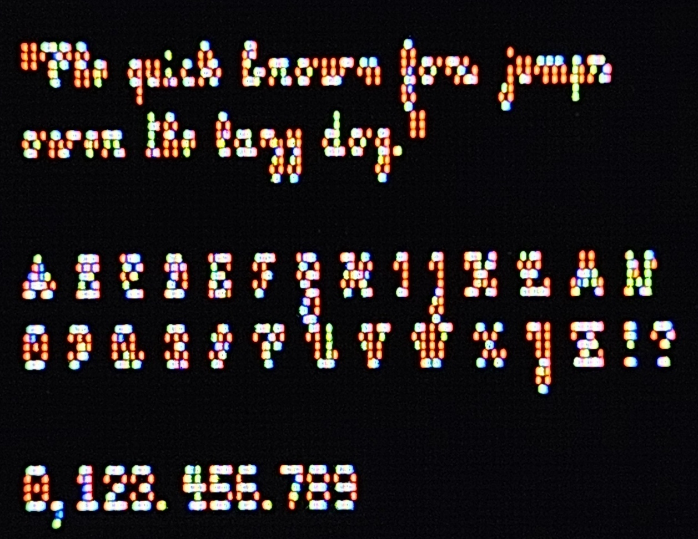| **µCursive** is a mostly 3x5 cursive-style subpixel font that is somehow very readable (and green!). |
|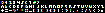 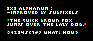|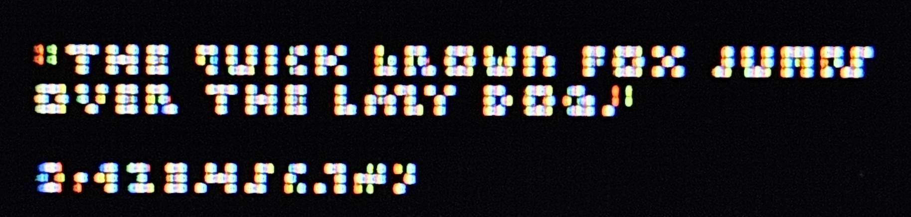| 3x3 alphanumeric font improved by using subpixels. |
| |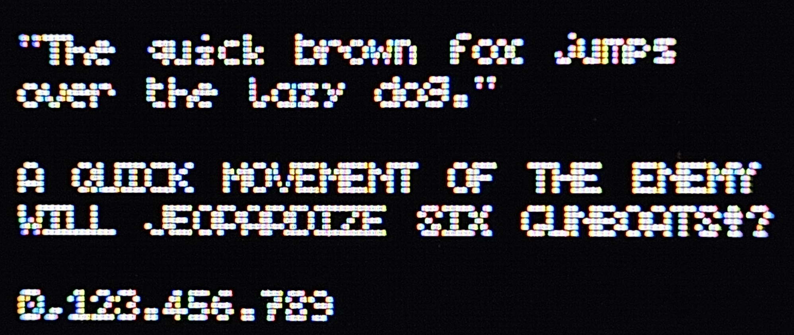| 4x5 very basic font using subpixels for the edges. |

The font set uses RGB subpixels to represent letters, so it needs colors to work. The rightmost pixels is always at most red, so two letters can be adjacent without a pixel of separation and still be reasonably readable, since there are still two empty subpixels between the letters. **This makes the mono version as compact as a 1 pixel wide font in practice!**

The name "µRed" (Micro Red) is based on the small size (smaller than regular pixel fonts), and the red appearance. The color red appears often  because of how a lot of letter shapes cover just the leftmost subpixel. The font works on a black background. While the negative (cyan on white background) is possible I find it harder to read. You can see here what you could see if you could separate the subpixels:

One last property is that zooming in the font digitally will render it unreadable (due to the subpixels being turned into whole pixels) especially if the characters are close together. Interesting for hiding messages "in plain sight" or messing with people. Real-life magnifying glass can be considered as an alternative for zooming! Otherwise, you will have to lean closer to your screen which can cause eyes strain. 

### Example:

|  | `I am the most hideous creature in the realm. ☺♫`   `A more abject appearance you will not find. ☻♪`   `I have fallen countless times, and yet I am here. ▼↓`   `Is it not proof that I possess the stone of life? ♥☼`|
|:------|:----------|

If you simply zoom into it, the subpixels will smudge and become unreadable:

If you could zoom into it while maintaining the subpixels structure, this is how it would look:

I'm not the first (nor the last) to play with the idea. [Examples: Militext](https://news.ycombinator.com/item?id=18702900), [TinyFont](https://mrl.nyu.edu/~perlin/homepage2006/tinyfont/), etc. I originally created the ascii 2x4 mono red font around 2016 (based on the file's date on my old computer). I was planning to debut it in a game, then time passed... The font is still being tweaked and extended over time with more characters and better readability in mind. The cursive version is a recent addition. 

