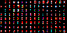

Presenting this 2x4 font:

It uses RGB subpixels to represent letters with only two pixels of width.
Based on the red pixel for the leftmost, on black background.
Two letter can be adjacent (no pixel separation) and still be readable.

With a python tkinter app to create text images with it:

(And a .exe made in GameMaker too)

There's a version of the font that is wider for better differenciating W, H, M, N's...

The font was originally created in June 2016 by Akira BAES, then tweaked and extended to cover basic ASCII later on.