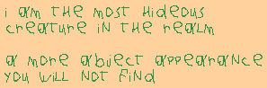
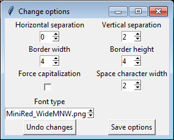
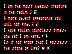
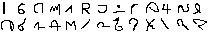

# Bitmap Pixel Font Visualizer

Load a pixel font sheet easily and start typing text with it.

/fonts contains the character sheets in .png and their corresponding character content in .txt

>**badlydrawn**.png  

>**badlydrawn**[chars].txt  
~~~~
ABCDEFGHIJKLM  
NOPQRSTUVWXYZ  
~~~~

font_to_data.py then generates a .json with the sheet infos (positions, sizes of each character)

>**badlydrawn**[posiz].json  
Position of each character on the image, background color, max width, max height

font_visualizer.py in the root allows to load those fonts and use them to show text.

>

The text is customizable and there are many options to change.

>

----

# The fonts

The main purpose of the application was to visualise some special fonts that required using a (colored) bitmap font type (badlydrawn is just a testing font that's badly drawn).

----

**µRed** (mono and wide) is a 2x4 ascii colored font (and probably the most compact font known outside of a 3x3).

> 

It uses RGB subpixels to represent letters with mostly only two pixels of width. Hence, it requires a colored bitmap basis.

The name "µRed" (MicroRed) / "MiniRed" is based on the small size (maybe the smallest "readable" font ever?), and the red appearance. The color red appears often  because of how a lot of letters cover just the leftmost subpixel. The font works on a black background. While the negative (cyan) is possible I find it harder to read.

Due to the rightmost pixels always being at most red, two letters can be adjacent without pixel separation and still be reasonably readable, since there are still two empty subpixels between the letters. This makes it even more compact!

One last property is that zooming in the font digitally will render it unreadable (due to the subpixels being turned into whole pixels) especially if the characters are close together. Interesting for hiding messages "in plain sight" or messing with people. Real-life magnifying glass can be considered as an alternative for zooming! Otherwise, you will have to lean closer to your screen which can cause eyes strain.

> 

There are two versions of the font: a MONO that's consistently 2 pixels wide, 
and a WIDE version that uses three pixels for letters that are difficult to distinguish otherwise 
like M, N, W...

The MiniRed (now µRed) was originally created around 2016 by Akira BAES. It's still tweaked and extended over time though.

----

**Formula and Formula16** are just fonts substituting the Roman alphabet with my personnal alphabet. It's a dumb substitution. 

> 

The letters were imagined by deforming hand-written letter (the loop of the e becomes a spike, etc.), or using other mental shortcuts to try to create something opaque to understanding at first look but easy to remember.